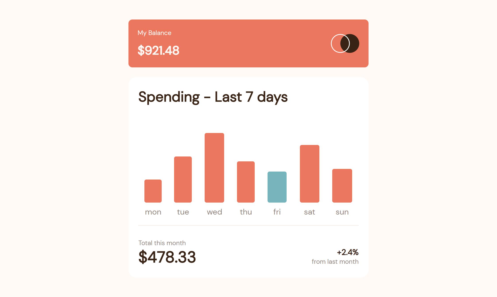
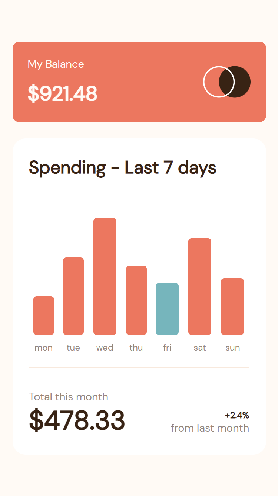

# Frontend Mentor - Expenses chart component solution

This is a solution to the [Expenses chart component challenge on Frontend Mentor](https://www.frontendmentor.io/challenges/expenses-chart-component-e7yJBUdjwt). Frontend Mentor challenges help you improve your coding skills by building realistic projects. 

## Table of contents

- [Overview](#overview)
  - [The challenge](#the-challenge)
  - [Screenshot](#screenshot)
  - [Links](#links)
  - [Built with](#built-with)
  - [What I learned](#what-i-learned)
  - [Continued development](#continued-development)
- [Author](#author)

## Overview

Hello Everyone, This is my solution to the frontend mentor challenge "Result Summary Component", and Special thanks to frontend mentor! I am grateful for this oppotunity to learn!

### The challenge

Users should be able to:

- View the bar chart and hover over the individual bars to see the correct amounts for each day
- See the current day’s bar highlighted in a different colour to the other bars
- View the optimal layout for the content depending on their device’s screen size
- See hover states for all interactive elements on the page
- **Bonus**: Use the JSON data file provided to dynamically size the bars on the chart

### Screenshot

### Links

- Solution URL: [Solution URL](https://github.com/JamesBarr456/expenses-chart-component-main/tree/main)
- Live Site URL: [live Site URL](https://645ed4e500a4715fd417e104--resonant-pasca-26b0e5.netlify.app/)

### Built with

- HTML5 
- SASS
- JavasScript

### What I learned

This challenge presented me with several challenges from the "Animation" point of view, until now in the few projects I've done I only relied on flat pages with minimal animation effects.
Adding the animation of the start of the page to the bars to the Front mentor challenge led me to learn the good use of after and before as well as the use of keyframes.
Although the final results leave me satisfied, I feel that I can keep adding more features to make the page even greater and to allow me to grow in my knowledge of CSS and JavaScript.

### Continued development

I would like to continue investigating more about animation concepts in css and best practices of javascript code for handling information through json. For future challenges to be able to build more solid pages and better presentation.

## Author

- Github:  [Barreto Santiago Emmanuel](https://github.com/JamesBarr456)
- Frotend Mentor:  [@JamesBarr456](https://www.frontendmentor.io/profile/JamesBarr456)
- Instagram: [@barretoemmanuel](https://www.instagram.com/barretoemmanuel/)

